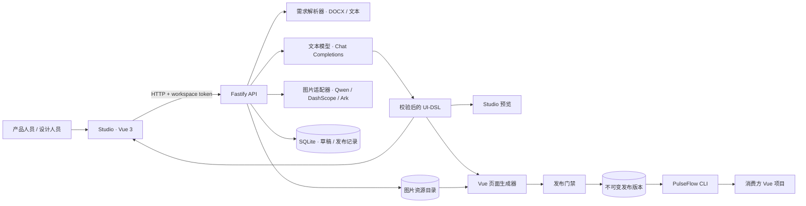
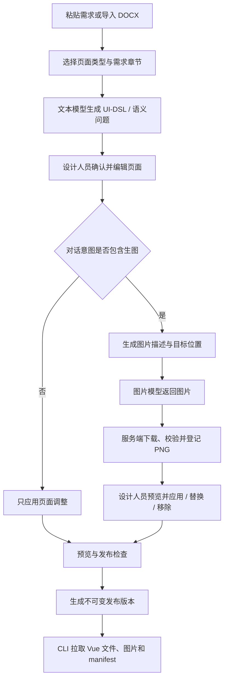

# PulseFlow 开发指南

PulseFlow 是一个把业务需求转成可编辑 Vue 3 页面草稿的工作台。设计人员可在 Studio 中检查页面结构、调整组件、通过对话修改页面，并按需生成配图；发布后，开发者可用 CLI 将页面和图片拉进自己的 Vue 项目。

本指南描述当前代码结构、开发环境和真实集成边界。面向使用者的操作步骤见[中文使用指南](docs/中文使用指南.md)。

## 系统架构



Studio 负责需求录入、页面编辑和预览；API 负责认证、模型调用、数据持久化和发布；`packages/ui-dsl` 定义页面模型，`packages/page-generator` 同时生成预览和可交付 Vue 文件。CLI 只下载已发布版本，不会修改消费方项目的路由或业务 API。

## 核心工作流



图片意图由对话模型输出结构化结果。明确的图片请求会走图片适配器；位置不明确时先让设计人员选 `` 内联位置或 Hero/内容区背景。图片失败不会丢弃同轮有效的页面修改。模型返回的外部 URL、任意 CSS 和代码不会直接进入 DSL。

## 仓库结构

| 路径 | 职责 |
| --- | --- |
| `apps/studio` | Vue 3 工作台：需求流程、草稿确认、画布、对话编辑、预览、发布 |
| `apps/api` | Fastify API：认证、需求/草稿/资产/发布/CLI 下载路由 |
| `packages/requirement-import` | 解析 DOCX 和粘贴的需求文本 |
| `packages/model-adapter` | 文本模型、结构化页面生成、图片协议适配及图片校验 |
| `packages/ui-dsl` | 页面 DSL、组件属性和输入校验 |
| `packages/page-generator` | 将 DSL 渲染成预览和 Vue 页面文件 |
| `packages/vue-template` | 干净模板及发布构建使用的 Vite 环境 |
| `packages/contracts` | Studio 与 API 共享的数据契约 |
| `packages/cli` | 下载发布版本、校验哈希并安全写入消费方项目 |
| `docs` | 中文使用指南、手册、设计规格和实施计划 |

## 环境要求与本地启动

- Node.js 22 或更新版本
- pnpm 10.33.0
- 一个接受 OpenAI Chat Completions 请求的文本模型服务

安装并创建本地配置：

```sh
corepack enable
corepack prepare pnpm@10.33.0 --activate
pnpm install
cp .env.example .env
```

编辑 `.env` 中的占位值。文本模型接口需接受带 `messages` 与 `response_format: { type: "json_object" }` 的 Chat Completions 请求，并把生成内容放在 `choices[0].message.content`。外部模型地址使用 HTTPS，保护传输中的 Bearer Key。PulseFlow 不会自动读取 `.env`；启动进程前，在对应终端加载环境变量：

```sh
set -a
source .env
set +a
```

在两个终端分别启动 API 和 Studio：

```sh
pnpm --filter @pulseflow/api dev
```

```sh
pnpm --filter @pulseflow/studio dev
```

API 默认监听 `http://localhost:3000`，Studio 通常运行在 `http://localhost:5173`。Studio 的 Vite 代理把 `/api` 转发到 API；自定义 API 地址可通过 `PULSEFLOW_API_URL` 设置。登录时使用 `PULSEFLOW_WORKSPACE_TOKEN`。

## 环境变量

| 变量 | 用途 | 默认值 / 说明 |
| --- | --- | --- |
| `PULSEFLOW_WORKSPACE_TOKEN` | 保护工作区 API 和 Studio 会话 | 必须设置为随机长令牌 |
| `PULSEFLOW_DB_PATH` | SQLite 数据库路径 | `./data/pulseflow.sqlite` |
| `PORT` | API 监听端口 | `3000` |
| `PULSEFLOW_MODEL_BASE_URL` | 文本模型服务基础地址 | 必须设置；API 追加 `/chat/completions` |
| `PULSEFLOW_MODEL_NAME` | 文本模型 ID | 必须设置 |
| `PULSEFLOW_MODEL_API_KEY` | 文本模型 Bearer Key | 必须设置，仅在 API 服务端使用 |
| `PULSEFLOW_IMAGE_MODEL_NAME` | 图片模型 ID | 通用模式默认 `qwen-image-2.0`；Ark 模式默认 `doubao-seedream-5.0-lite` |
| `PULSEFLOW_IMAGE_API_URL` | 图片请求完整 URL | 通用 Chat 模式默认 `${PULSEFLOW_MODEL_BASE_URL}/chat/completions`；其他模式默认 `/images/generations` |
| `PULSEFLOW_IMAGE_API_MODE` | 图片协议 | `openai-chat-completions`、`openai-images`、`dashscope-native` 或 `volcengine-ark-images` |
| `PULSEFLOW_IMAGE_API_KEY` | 图片服务 Bearer Key | 未设置时复用 `PULSEFLOW_MODEL_API_KEY` |
| `PULSEFLOW_IMAGE_TIMEOUT_MS` | 图片请求超时 | `120000` 毫秒 |
| `PULSEFLOW_IMAGE_RESULT_HOSTS` | 图片结果 URL 的主机白名单 | 逗号分隔；Ark 模式有方舟对象存储默认主机 |
| `PULSEFLOW_ASSET_DIR` | 服务端图片资源目录 | 默认放在 SQLite 文件旁的 `assets/` |
| `PULSEFLOW_API_URL` | Studio API 代理地址 | `http://localhost:3000` |
| `PULSEFLOW_URL` | CLI 默认 API 地址 | `http://localhost:3000` |
| `PULSEFLOW_TOKEN` | CLI 工作区令牌 | 执行 `pulseflow pull` 时使用 |

不要把填入真实 Key 的 `.env` 提交到版本库。图片模型只由 API 服务调用，浏览器不会直接持有上游 Key。

### 图片提供方

- `openai-chat-completions` 使用 `model` 和 `messages` 请求体，默认模型为 `qwen-image-2.0`。
- `openai-images` 使用 OpenAI Images 风格的 `/images/generations` 请求。
- `dashscope-native` 使用 DashScope 原生多模态请求结构。
- `volcengine-ark-images` 使用 Ark 图片生成接口，默认请求 Seedream 2K、URL 响应和无水印。`.env.example` 提供完整 URL、单独图片 Key 和结果主机示例。

四种模式都使用 HTTPS；每次只请求一张图片。远程结果 URL 要匹配白名单，并经过 DNS/IP 检查、固定 IP 下载、大小限制和图片格式验证。系统统一存储 PNG；Ark 返回的 JPEG 会先转换为 PNG。

TokenRhythm 的 Chat Completions 生图请求已按用户提供的请求样例接入，但该 Key 最近一次只读 `/v1/models` 查询没有列出 `qwen-image-2.0`，且其成功图片响应尚未通过真实调用确认。Ark Seedream 模式则按仓库当前配置与用户的单次真实验收记录接入。自动化测试使用 mock，不调用计费模型。

## 草稿、DSL 与图片资产

需求解析结果进入文本模型后，会被限制为支持的 UI-DSL 组件和属性。页面类型包含企业官网与管理平台；模型输出经过 schema 与页面结构校验后才可保存或应用。页面预览使用样例数据和模拟操作，真实业务 API 由消费方项目接入。

图片通过 API 资产 ID 引用。DSL 支持 `Image` 内联组件，以及 Hero/ContentSection 背景；不接受外部 URL、data URL、任意 CSS 或文件路径。Studio 通过认证 API 获取图片并创建临时 Blob URL；发布版本只打包实际引用的 PNG。源需求内容用于解析和生成，不存入草稿或发布记录。

## 发布和 CLI

发布包含三个阻断门禁：

1. `dsl`：校验 DSL、字段绑定、语义问题和生成文件一致性。
2. `preview-compile`：编译生成 Vue 页面脚本与模板。
3. `template-build`：将页面放进干净 Vue 模板并执行 Vite build。

TypeScript 与 ESLint 不属于发布门禁；它们仍可通过开发命令单独检查。发布保存不可变版本；后续修改需要新草稿并重新发布。

构建 CLI：

```sh
pnpm --filter @pulseflow/cli build
```

在消费方 Vue 项目根目录执行：

```sh
PULSEFLOW_TOKEN="$PULSEFLOW_WORKSPACE_TOKEN" \
  node /path/to/PulseFlow/packages/cli/dist/main.js pull <pageId> \
  --base-url http://localhost:3000
```

页面和资源会写入 `src/views/<pageId>/`，并生成 `.pulseflow/manifest.json`。CLI 会打印 Vue Router 接入片段，但不会修改路由或安装依赖。首次拉取支持干净项目；后续拉取按 manifest 哈希检测本地改动，发现冲突时停止覆盖，并显示差异。

## 开发检查

```sh
pnpm typecheck
pnpm test
pnpm coverage
pnpm build
```

也可以一次执行全部本地验证：

```sh
pnpm verify
```

Playwright 确定性流程单独运行：

```sh
pnpm e2e
```

E2E 使用合成需求和假模型，验证 Studio、API、发布和 CLI 的本地流程，不代表真实模型服务或外部业务项目已通过验收。`pnpm lint` 可单独运行 ESLint。

## 当前范围

- 支持粘贴文本和导入 `.docx` 需求，DOCX 最大 10 MB。
- 支持需求生成、空白画布、设计对话、视觉/JSON 编辑、预览和发布。
- 页面仅使用注册过的 UI-DSL 组件；这不是通用代码生成器。
- 预览使用模拟数据和交互，不实现消费方的业务接口、登录系统或数据持久化。
- CLI 下载已发布页面和资源，不会把消费方本地改动推回 PulseFlow。
- TokenRhythm `qwen-image-2.0` 的当前 Key/可用性和图片响应格式仍需通过提供方成功响应确认；不要把本地 mock 结果视为真实网关验收。
