# PulseFlow Studio 机器人官网制作手册

**实测日期：2026-09-27**
**适用对象：第一次使用 PulseFlow Studio 的用户**
**本次演示：灵犀机器人官网，从工作区登录到版本发布**

> 本文记录本次 Studio 的实际操作。配图均为本地 Studio 实拍截图，保存在 `docs/pulseflow-studio-manual/screenshots/`。

> **截图版本说明：** 配图拍摄于 2026-09-27，可用于了解登录、需求生成、对话、预览和发布流程。工作区之后继续调整了 Figma 式面板比例和 Frame 拖放交互；这些旧截图不代表当前画布的最终外观，也不能作为新交互的实测验收图。

## 1. PulseFlow Studio 是什么

PulseFlow Studio 用来把业务需求整理成可编辑的网页或管理平台。你可以先用文字描述需求，让系统生成页面草稿；再通过对话、画布和属性面板调整内容；最后运行检查并发布一个只读版本。

主要流程是：**登录 → 导入需求 → 选择生成范围 → 检查页面草稿 → 画布与对话迭代 → 发布检查 → 发布版本**。

页面结构由 UI-DSL 描述。可以把 UI-DSL 理解成页面的结构清单：它记录页面有哪些区块、文字、图片、表单和它们之间的关系。Studio 会校验这份清单，通过后才把结果应用到画布或发布。

## 2. 本次完成的页面

本次从空白需求生成了“灵犀机器人”中文企业官网，包含顶部导航、机器人首屏、产品能力、工业巡检/仓储物流/商业服务场景、示例数据、团队介绍、预约演示表单和行动入口。机器人主视觉由方舟 Seedream 生成，并应用为首屏背景。

演示数据已经标注为示例。预约表单目前只展示前端页面，没有连接客户管理或提交后端。截图中显示的发布版本为 **`lingxi-robot-home-v2`**；Studio 发布会保存只读版本，不会自动部署到公网。

## 3. 开始前准备

1. 在项目根目录安装依赖并启动本地服务：

       pnpm install
       pnpm dev

2. 打开终端输出的 Studio 地址，进入工作区登录页。
3. 工作区令牌及模型配置保存在根目录 `.env`。不要把密钥贴进需求、对话、截图或 Markdown，也不要提交 `.env`。
4. 图片生成可能产生费用。演示使用方舟 Seedream 5.0 Lite；如图片请求失败，先检查模型配置和配额，再使用页面中的“重新生成”。

如果密钥曾出现在聊天、日志或截图中，应到服务商控制台轮换，再把新值只存入本机 `.env`。

## 4. 按页面完成官网

### 第 1 步：登录工作区

在“工作区登录”页面输入 `.env` 中的工作区令牌，然后点击“进入 Studio”。令牌只用于当前本地工作区会话。

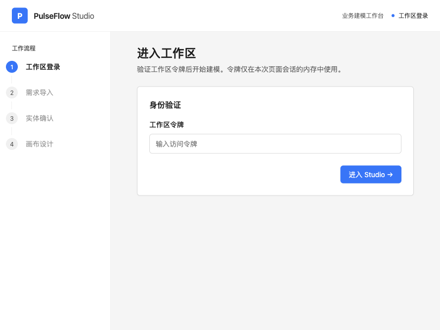

登录后会进入需求导入页面。

### 第 2 步：选择页面类型并写需求

在“生成页面类型”选择“企业官网”。需求最好写清品牌、目标用户、导航、首屏标题、主要区块、图片风格和联系方式；如果用 Markdown 标题分段，系统更容易把需求拆成可选择的章节。

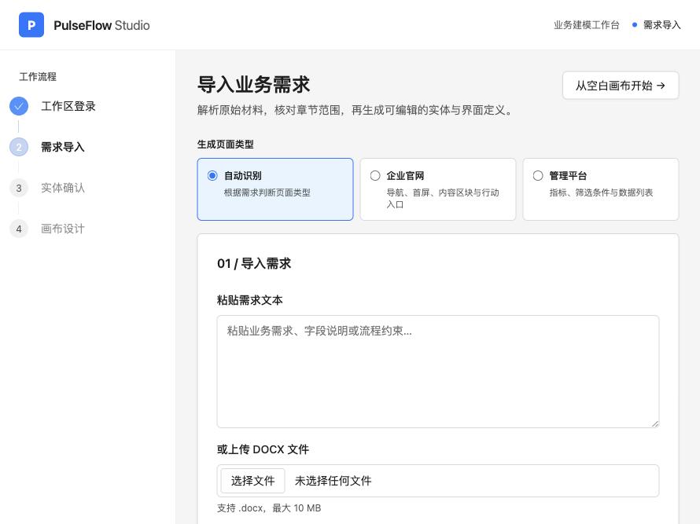

本次需求描述了科技风机器人官网、蓝色主色、产品能力、三个行业场景、团队介绍和预约演示入口。

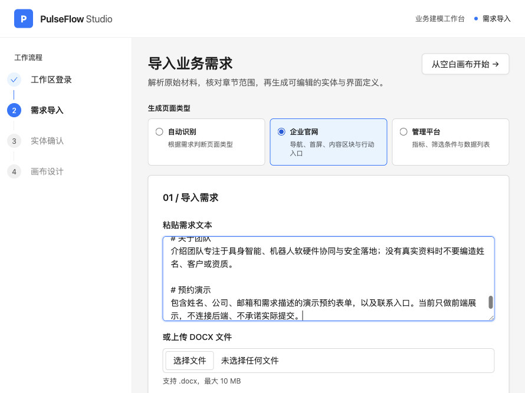

### 第 3 步：选择生成内容

点击“解析需求”后，系统会把文本整理为章节。只勾选要交给生成服务的部分；未命名的一整段需求也可以勾选“选择 无标题内容”。

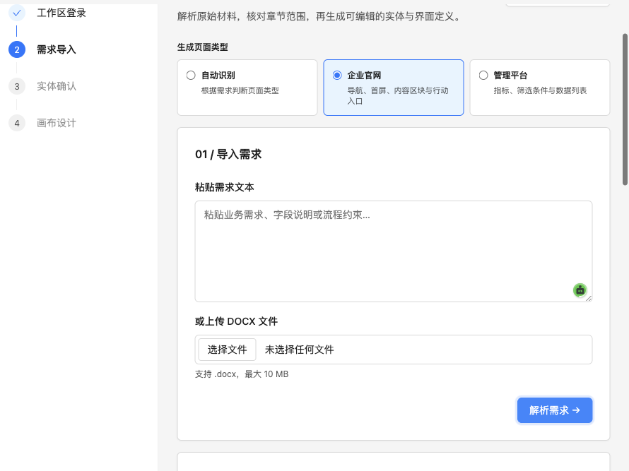

点击“生成草稿”后等待系统整理页面结构和实体字段。

### 第 4 步：检查草稿并回答问题

在“确认实体结构”页检查 UI-DSL 与实体字段。页面草稿包括网站导航、首屏、产品与场景区块、指标、联系表单等内容。遇到没有真实来源的数据或未接入的表单，要明确告诉系统并保留为示例。

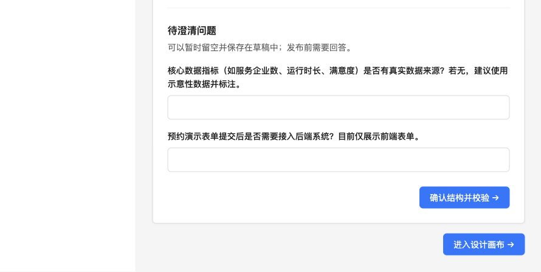

回答系统提出的待澄清问题。本次说明指标是示意数据、预约表单暂不接后端。

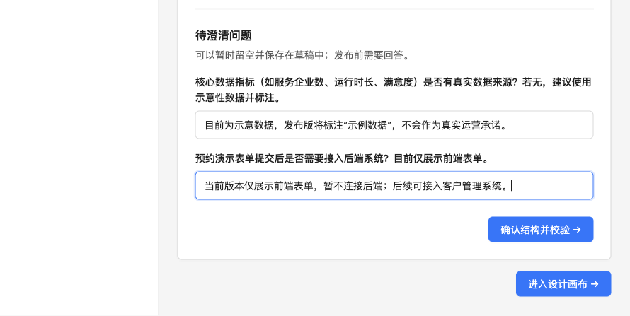

点击“确认结构并校验”。看到“校验通过并已保存草稿”后，再进入设计画布。

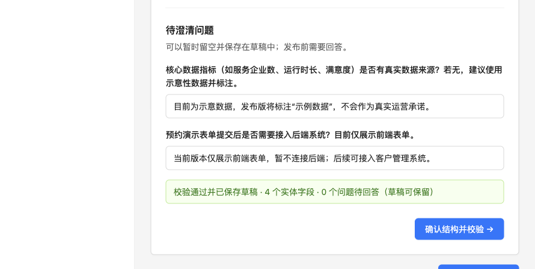

### 第 5 步：认识设计画布

设计页采用 Figma 式工作区：左侧活动栏可切换 File、Assets、Tools、Variables；File 中 Pages 和 Layers 同时显示，中间是网页画布，右侧是属性检查器。双击当前活动页面可直接改名，名称会同步到画布标题和 UI-DSL；也可在右侧页面属性中修改。点击页面对象可选中它；绝对定位图层拖动时会吸附到画布中其他未选中的可见图层及父级 Frame/容器的边缘和中心线，释放后最终坐标写入 UI-DSL；多选拖动时按整个选区外框对齐，并把相同校正量应用到各图层；选中后可在画布移动、拖动控制点缩放，也可在右侧调整内容和样式。绝对定位图层直接拖过 Frame 时，目标画框会高亮；在高亮画框上释放后，图层会改为它的子图层，并按画框内容区换算局部坐标，以保留释放位置。多选时一次移动整组选区；如果图层或目标画框有旋转、翻转等无法安全换算的变换，就不会显示可放置高亮。Position 区可设置 X/Y、旋转和翻转；绝对定位图层可用坐标对齐按钮在父容器内对齐。流式图层保留 Frame 自动布局：主轴位置由顺序和分布控制，交叉轴对齐按钮可单独调整当前图层；若交叉轴设为 Fill，图层已拉伸到容器边界，对齐按钮会禁用。Hug/Fill 控制尺寸。所有对齐值会校验后写入 UI-DSL，并由实时预览和生成页面共用渲染规则。Appearance 区可切换图层可见性并设置透明度和圆角。图层树可按名称或文字搜索；命中子图层时会保留其父级路径。图层树也可展开/折叠、隐藏或锁定对象；将图层拖到 Frame、卡片等容器行可把它嵌套到该容器，拖到行的前后位置则调整同级顺序；每次变更都会校验页面结构。锁定会阻止画布变换、属性编辑、删除和移动，仍可在图层树选中并解锁。在画布空白处拖动可框选对象，按住 Shift 再拖动可把框选结果加入当前选区；被锁定或隐藏的图层不会被框选。选择多个符合条件的图层后，按 Ctrl/⌘+G 组合为画框；按 Ctrl/⌘+Shift+G 取消组合，操作会写入 UI-DSL 并可撤销。组合要求图层位于同一父容器、连续排列且未旋转或翻转；绝对定位图层需有固定尺寸，流式图层需位于起始对齐的 Frame 中。按住 Alt/Option 拖动图层会在目标位置创建副本；按 Delete/Backspace 删除选中图层，按 Ctrl/⌘+Z 撤销。底部工具栏可切换选择、画框、形状、文字和图片工具，也可切换桌面、平板、手机视口、缩放及撤销/重做。选择画框、形状、文字或图片工具后，在画布上点击可按默认尺寸放置，拖动可按拖动范围创建；按 Esc 或选择箭头工具返回选择模式。每次放置都会作为一次可撤销修改写入 UI-DSL。

画布对话助手会优先放在当前画板旁边有足够空间的一侧，尽量不遮挡设计；两侧空间都不足时会收成圆形 AI 入口，点击后可展开继续对话。

图层树中的图层可双击重命名，右侧检查器的“图层名称”字段与它保持同步；名称保存为 UI-DSL 的 `design.name` 元数据，不会成为页面上显示的文字。形状工具旁的下拉菜单可选择矩形、椭圆或直线。在灰色画布空白处使用 Frame、Shape、Text 或 Image 工具会创建顶层画板/对象；在某个 Frame 内使用工具会创建子图层。同一个 Page 可以放置多个顶层 Frame，它们会按画布坐标一起显示和缩放。按 Esc 会先关闭形状菜单或取消正在进行的画布操作，再退出绘制工具，最后清除选区。

Pages/Layers 左栏与右侧检查器之间的竖向分隔线可以左右拖动；聚焦分隔线后按方向键每次微调 8 像素，按 Shift 加方向键每次调整 24 像素。两侧面板宽度会保存在当前浏览器，下次打开 Studio 时恢复；窄屏会切换为覆盖式面板。

Assets 用于浏览内置、生成和导入图片；点击“上传图片”可导入本地 PNG、JPEG 或 WebP，上传后会按当前选择插入图片、替换图片或设置区块背景；也可以把已载入的素材卡片直接拖到画布或画框中创建图片图层。Tools 用于添加画框、形状、文字和语义组件；Variables 用于维护实体字段。拖动单个或多个图层时，按住 Shift 可锁定横向或纵向移动；拖动缩放控制点时，按住 Shift 可锁定比例；按住 Alt/Option 可从选区中心缩放，直接拖动图层时则复制到新位置。按 Shift+1 可适配整个画布，按 Shift+2 可缩放并居中到当前选区。

选择同一容器中连续排列、已对齐且间距一致的一行或一列图层，点击底部“自动布局”或按 Shift+A，可将它们转换为 Frame 自动布局；元素顺序、尺寸和间距会保留，并作为一次可撤销的 UI-DSL 修改保存。选区重叠、间距不一致、未对齐或不属于同一容器时，Studio 会显示原因且不修改页面。普通“组合图层”仍用于保留自由坐标的组合。

**自动布局与自由定位：** Frame 中使用画框、形状、文字或图片工具创建图层时，新图层会按指针所在位置加入横向或纵向布局。流式子图层在本 Frame 内拖动会按布局方向重排；多选拖动会保留选中项之间的顺序。多选同一容器内的流式图层并拖动缩放控制点时，尺寸会按比例调整并继续参与自动布局；只改变被拉伸的尺寸轴，另一轴的 Hug/Fill 模式会保留。只有同一容器内的流式图层或全为绝对定位的图层组可使用多选缩放。多选同一 Frame 中的流式图层可批量设置交叉轴对齐，主轴仍由图层顺序和 Frame 分布决定。按住 Alt/Option 拖动流式图层会在指针位置创建副本，副本仍参与目标 Frame 的布局。把流式子图层拖到另一个 Frame，会将它移动到目标 Frame 并继续参与目标布局。拖出任何 Frame 后松开，会让图层进入自由定位；调整流式子图层尺寸时仍保留它在布局中的位置。绝对定位图层始终按父级坐标自由移动。直接在检查器输入 X/Y 会将流式图层切换为绝对定位；可在“定位方式”中切回流式布局。上述操作都写入经过 UI-DSL 校验的历史记录，可撤销和重做。

文字图层可双击后直接在画布中编辑。按 Enter 提交，Shift+Enter 换行；点击画布其他位置会保存，按 Esc 会恢复编辑前的文字。提交会通过 UI-DSL 校验并进入撤销历史。

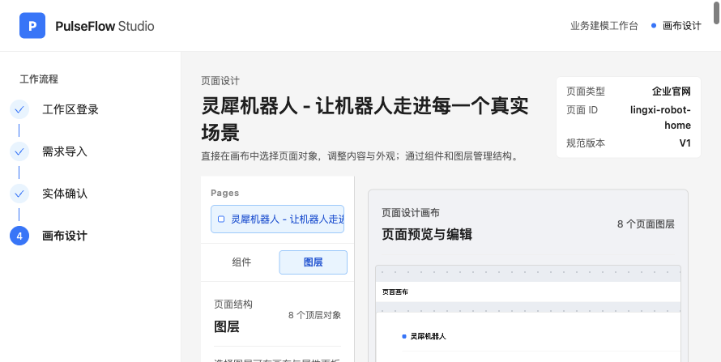

在较宽的桌面视口下，可以同时查看画布、图层与属性；本次的机器人首屏已经应用了生成图片。

完成页面编辑后，可以在画布中检查整页的区块顺序和内容。

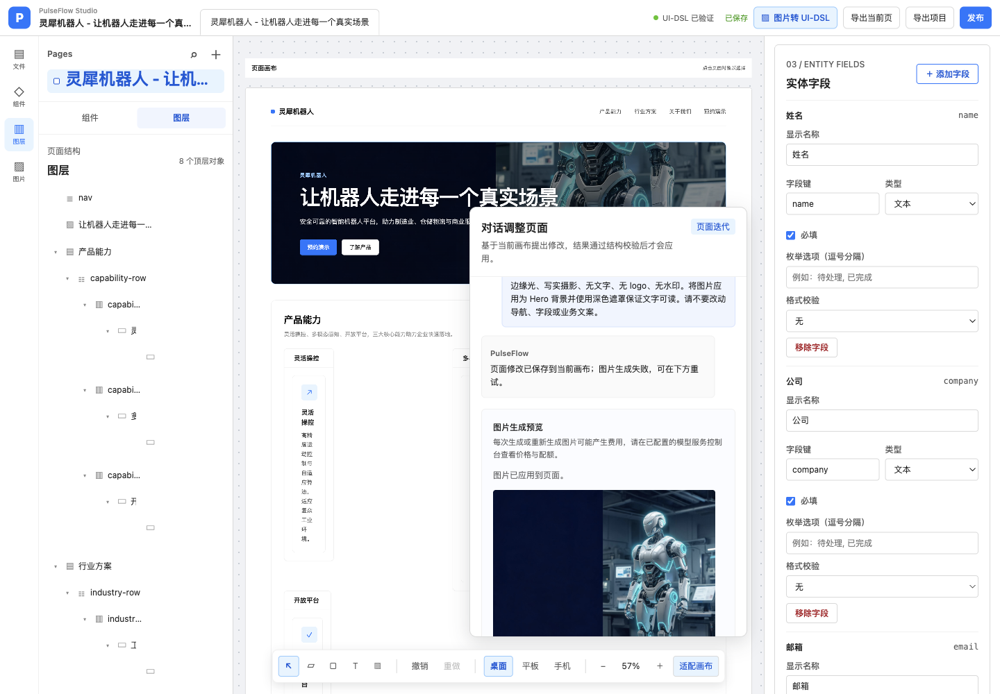

桌面和手机预览可分别检查宽屏布局与窄屏下的内容适配。

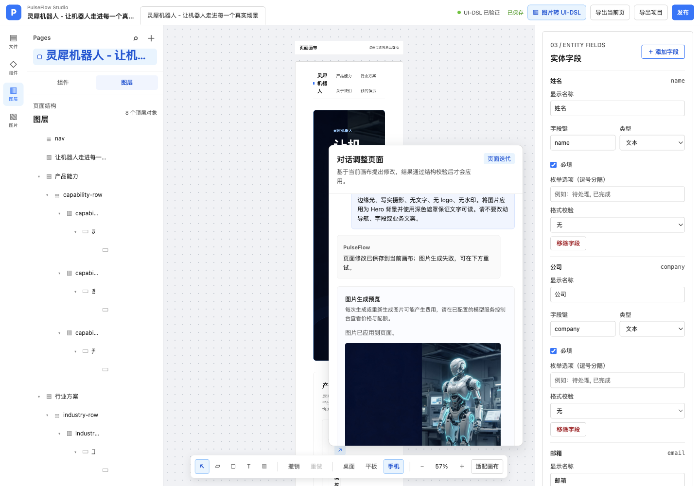

右侧“原型”面板可为按钮、导航、Hero 行动按钮和行动区块设置页面内跳转。选中 Frame 并切到“原型”后，可拖动画布上 Frame 右侧的蓝色连接点，连到另一个 Frame；现有连接会显示为画布连线，也可在右侧选择或清除目标。区块跳转目标必须是当前 UI-DSL 中存在的 ContentSection，Frame 跳转目标必须是另一现存 Frame；无效目标和连到自身都会被校验拒绝。设计画布中点击仍用于选择图层；实时预览和导出页面中点击连接好的 Frame 会平滑滚动到目标画框。项目动作标识由接入该页面的业务项目实现。

### 从截图自动生成 UI-DSL

如果你已有 Figma 导出的 PNG/JPEG/WebP 截图，点击页面标题区的“图片转 UI-DSL”。拖入截图或选择文件，选择“自动识别”或指定官网/管理平台，再写可选要求并点击“生成可编辑页面”。Studio 会先压缩图片；视觉模型识别页面类型、区域位置、语义图层名、可辨认的原始文案、容器关系和样式，服务端再把校验通过的区域计划转换成 UI-DSL。图层名与显示文案分开保存，减少把摘要写成页面文字的情况。每个文字图层最多 2000 字，保留原文换行和标点，较长内容按顺序拆成多个文字图层；无法辨认的文字会保留为空白、可编辑的文字或按钮图层，并在识别说明中提示。最多识别 120 个区域；识别达到上限时，候选说明会提示将截图分块导入。最终页面最多 150 个图层（含画板），并通过 UI-DSL schema 校验。子图层会尽量保留在识别到的 Frame/Card 容器中。

右侧预览显示候选页面和识别说明；识别到的图片区会用浏览器临时裁片即时预览，此时不上传、不保存页面素材。只有点击“应用到画布”才会替换当前画布并保存裁片素材；关闭面板或转换失败不会改动现有设计。应用结果后，仍可像 Figma 一样从图层树选择对象、在画布移动/缩放、在检查器精调，之后使用撤销/重做、预览、导出和发布。

转换出的画板名称使用页面标题，区域标签会保存为对应图层名；可在图层树双击继续调整名称。截图生成的根 Frame 按原图画板尺寸保存在 UI-DSL 中，编辑画布也按该宽高显示；切换普通桌面/平板/手机视口不会改写这份固定尺寸，若要设计不同尺寸请分别创建 Frame。

图像理解模型需要支持 OpenAI 兼容 Chat Completions 的 `image_url` 输入和 JSON 输出。可在 `.env` 配置 `PULSEFLOW_VISION_API_URL`、`PULSEFLOW_VISION_MODEL_NAME` 和 `PULSEFLOW_VISION_API_KEY`；不设置时会沿用通用模型配置。变量示例见项目根目录 `.env.example`。截图会发送给所配置的模型服务，原始整张截图不会作为页面素材保存；点击“应用到画布”后，识别到的图片区会从截图裁切为独立页面素材，以便预览、编辑和发布，取消导入则不会保存这些裁片。使用提供的 Figma 工作区截图进行了一次模型转换，得到 62 个通过校验的节点，包含 Frame、Text、Button、Card 和 Input，并保留了最多两层容器嵌套；实际结果会随截图和模型输出变化。

### 第 6 步：通过系统对话改页面和生成图片

在“对话调整页面”中直接写希望改什么。选中图层后，对话框会显示修改目标；模型只能修改所选图层及其子图层，页面其他部分、数据字段和问题记录保持不变。多选时会把整个选区作为目标；不选图层时则按整页修改。锁定图层需要先在 Layers 面板解锁。候选结果通过 UI-DSL 校验后才会更新画布，且仍可撤销。

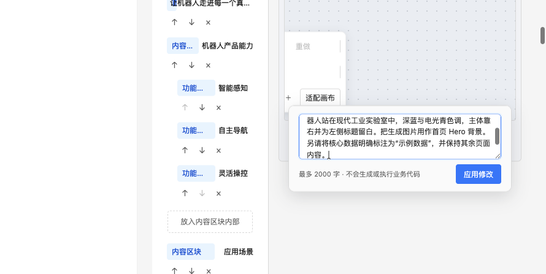

本次要求生成一张银白色双足服务机器人处于工业实验室的图片，机器人靠右、左侧留白、深蓝和电光青色调，并作为 Hero 背景。

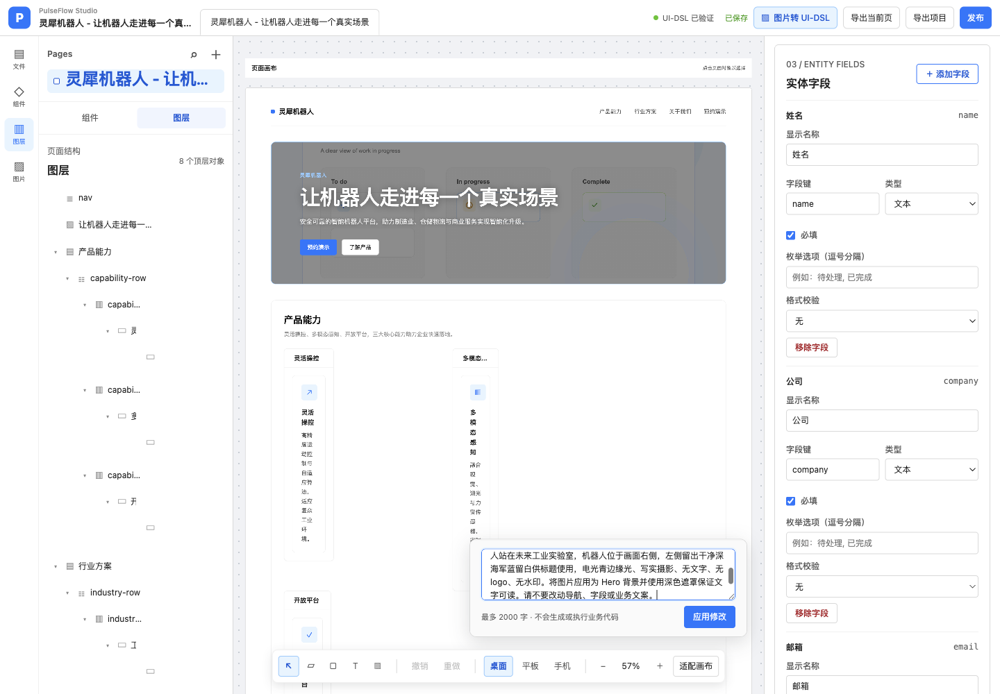

如果预览显示图片生成失败，先检查页面提示；确认配置和额度正常后可点击“重新生成”。不要因为状态未更新连续重复提交。

成功后，预览会显示生成图片以及“图片已应用到页面”。本次生成结果是 2848×1600 横图，已作为首页 Hero 背景。

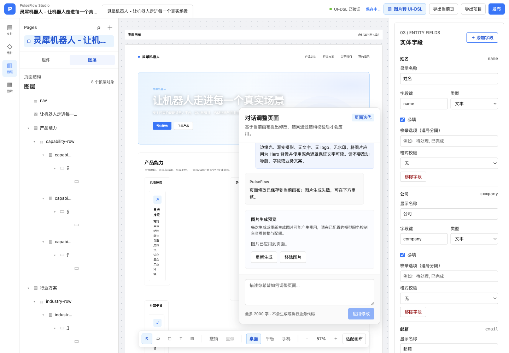

发布前再核对一次示例指标与表单能力：演示数据应标注为示例，预约表单若未连接后端就只能展示页面，不能承诺真实收集线索。此项检查在下方发布检查页面完成。

### 第 7 步：发布检查并发布

发布前检查页面内容、图片、导航和表单说明。然后点击“运行检查并发布”。Studio 会执行 DSL 校验、预览编译和页面构建；全部通过后创建只读发布版本。

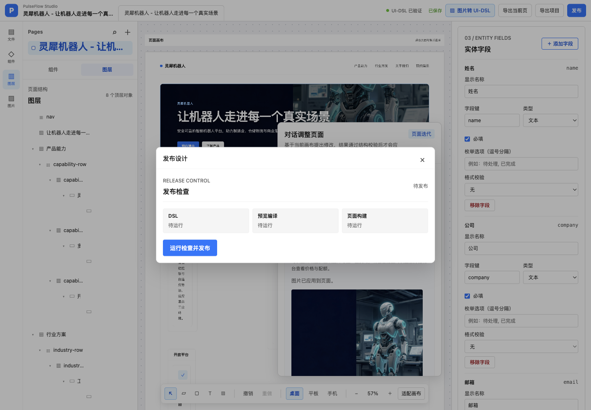

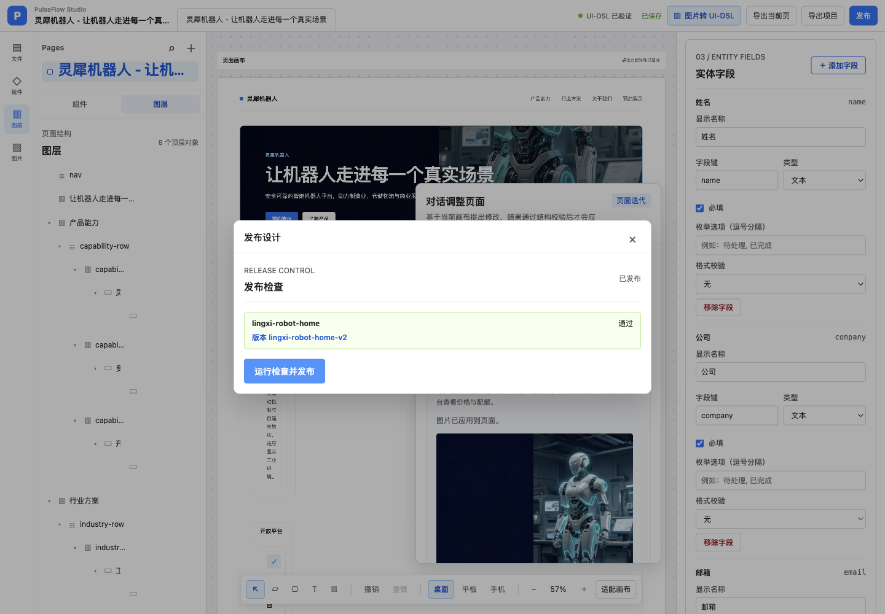

截图显示三项门禁均通过，已发布版本号为 `lingxi-robot-home-v2`。

## 5. 下次如何使用

1. 在项目根目录运行 `pnpm dev`，打开本地 Studio 地址。
2. 用工作区令牌登录，选择“企业官网”或“管理平台”。
3. 写清需求并解析，选择需要生成的章节。
4. 检查 UI-DSL 与字段，回答所有待澄清问题，再运行结构校验。
5. 在画布中用对话调整文字和图片，也可以用图层、画布与右侧属性面板精修。
6. 核对示例数据、表单能力和图片，再点击“运行检查并发布”。
7. 记录发布版本号。若要部署到实际 Vue 项目或公网，继续阅读[中文使用指南](中文使用指南.md)并使用 PulseFlow CLI；Studio 发布本身不会托管公网网站。

## 6. 常见情况

- **生成范围为 0 章**：回到章节选择，把需要的章节勾选上；整段无标题内容可选择“无标题内容”。
- **草稿结构校验失败**：查看页面提示的诊断路径，修正 UI-DSL 或字段，再重新校验。
- **图片生成失败**：查看图片预览区域的提示，确认图片模型、密钥、配额和网络后再点“重新生成”。
- **发布门禁未通过**：根据 DSL、预览编译或页面构建对应的诊断修复后再发布。
- **想改变画布位置却拖不动**：先点击对象选中；选中对象后再拖动。未选中的图层保留层级拖放行为。

## 截图目录

本次流程截图位于 `docs/pulseflow-studio-manual/screenshots/`，包含登录、需求导入、草稿确认、设计画布、系统对话、图片生成、示例数据和发布状态。
