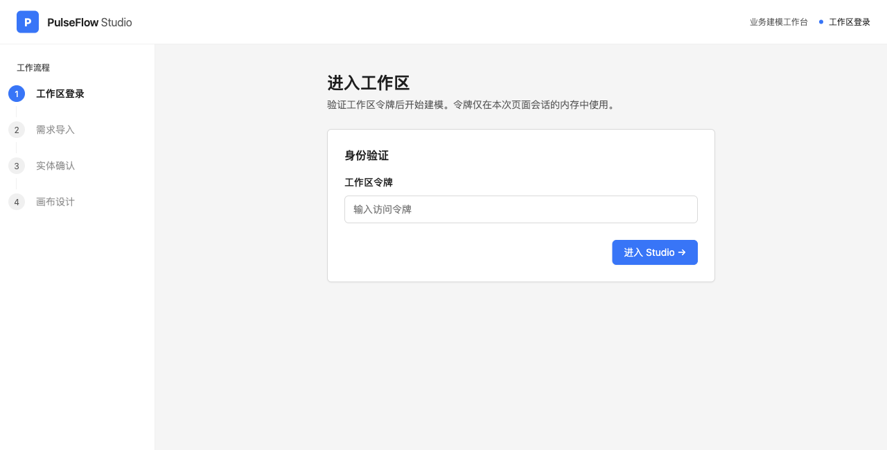
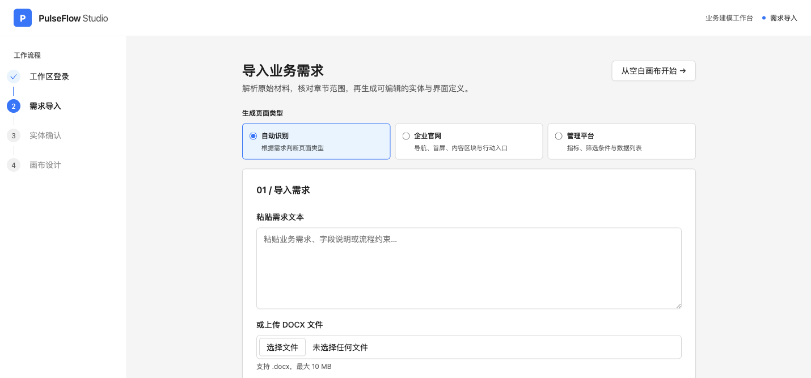
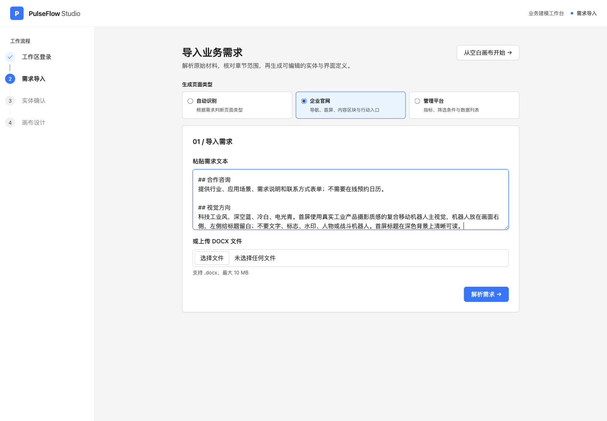
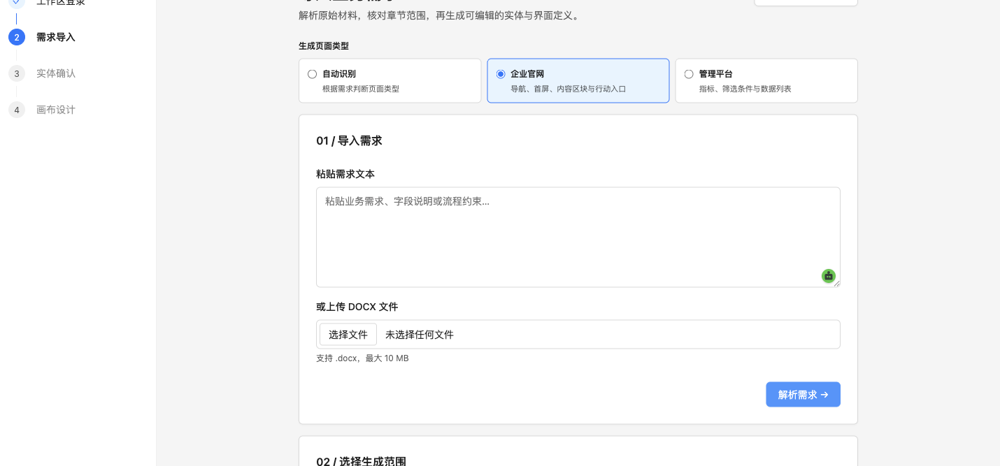
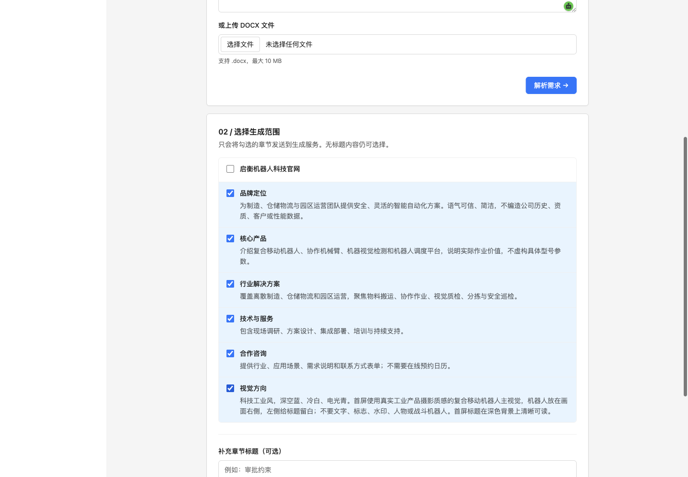
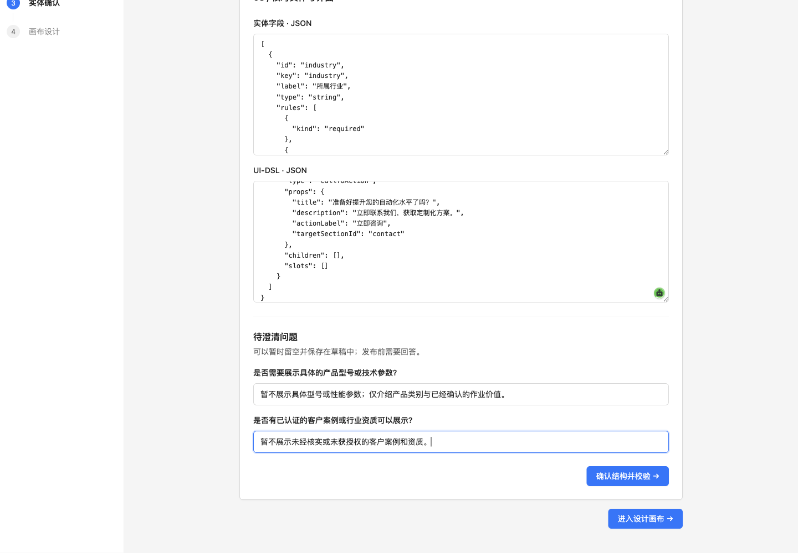
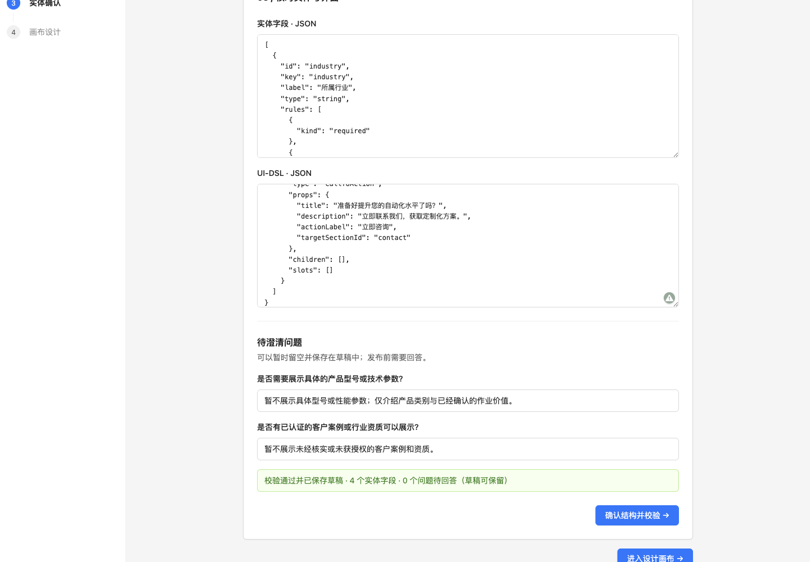
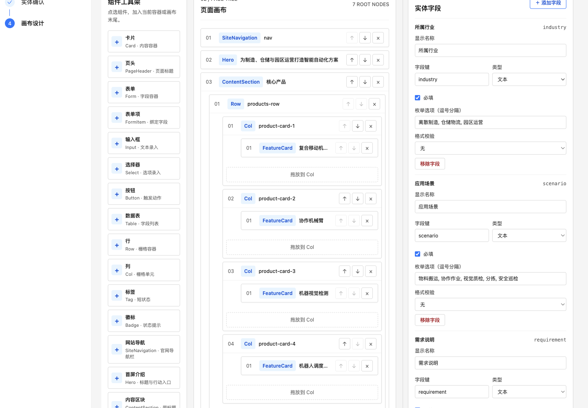
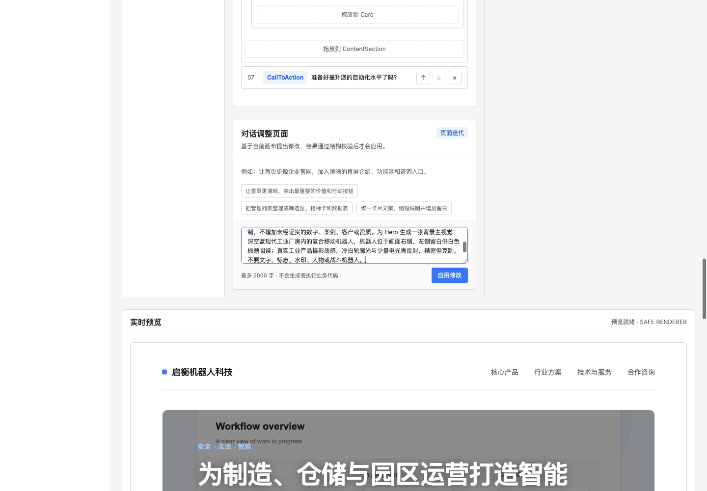
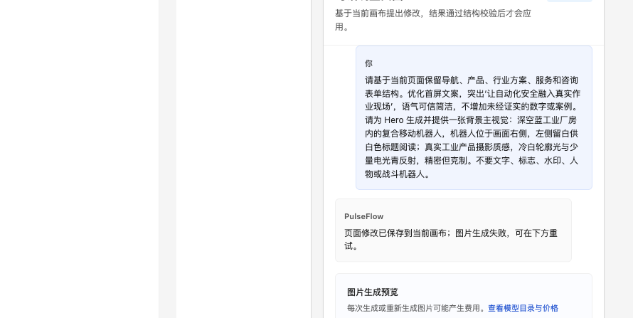

# PulseFlow 机器人官网制作手册 V1.1

本文记录在 PulseFlow Studio 中重新制作“启衡机器人科技”官网的实际流程。截图来自本次 Ego Lite TaskSpace 5 内真实操作；截图不包含工作区令牌或 API 密钥。

> **当前进度（2026-09-27）**：已登录 Studio，解析并选择官网需求章节，生成草稿、回答澄清问题、通过结构校验并进入设计画布。系统对话已成功修改文案；图片生成仍失败，尚未完成图片应用、最终预览和 V1.1 发布。已有旧版本 `qiheng-robotics-home-v1` 保持不变。

## 官网目标

为启衡机器人科技制作企业官网，面向制造、仓储物流和园区运营团队，介绍复合移动机器人、协作机械臂、机器视觉检测及调度平台。视觉方向为深空蓝、冷白和电光青，使用真实工业机器人主视觉，不使用战斗机器人、虚构客户案例、未经证实的型号或性能数字。

## 制作步骤与截图

### 1. 登录 PulseFlow Studio

打开本地 Studio 登录页，使用本地工作区令牌进入工作区。不要把令牌发到对话中，也不要截入手册。



### 2. 选择官网页面类型

登录后进入“导入业务需求”。选择“企业官网”，该类型会围绕导航、首屏、内容区块和行动入口组织页面。



### 3. 输入并解析结构化需求

在“粘贴需求文本”中使用 Markdown 标题区分内容。解析器会按标题拆成章节；没有标题的长段落会被识别为“无标题内容”，不利于后续选择生成范围。

本次整理为品牌定位、核心产品、行业解决方案、技术与服务、关于启衡、合作咨询和视觉方向七个章节。



### 4. 选择需要生成的章节

本次选择品牌定位、核心产品、行业解决方案、技术与服务、合作咨询和视觉方向六章；“关于启衡”不单独成章，避免生成未经证实的公司历史或资质。





### 5. 检查草稿并回答澄清问题

生成结果包含四个咨询表单字段：所属行业、应用场景、需求说明和联系方式。系统询问产品参数、在线预约和客户案例后，分别说明不展示未确认参数、不提供在线日历、不展示未核实或未授权的客户信息。



回答后运行结构校验。本次显示校验通过、4 个实体字段、0 个问题待回答，再进入画布。



### 6. 在画布中使用系统对话修改文案并请求主视觉

设计画布显示企业官网的组件工具架、页面结构、属性区、实时预览和发布检查面板。通过“对话调整页面”保留导航、产品、行业方案、服务和咨询表单结构，强化首屏价值表达，并请求生成一张深空蓝工业厂房中的复合移动机器人主视觉。





系统确认文本修改已保存到当前画布，但图片请求返回 HTTP 400。当前截图记录了失败状态；由于本地 `.env` 尚未配置方舟图片 API，不重复调用旧图片网关。



### 7. 配置火山方舟图片模型并生成图片

Seedream 5.0 Lite 接口已通过单张请求验证。请先轮换曾暴露在聊天中的旧密钥，再将新密钥写入本地 `.env`，不要写进此文档：

```dotenv
PULSEFLOW_IMAGE_API_URL=https://ark.cn-beijing.volces.com/api/plan/v3/images/generations
PULSEFLOW_IMAGE_API_MODE=volcengine-ark-images
PULSEFLOW_IMAGE_MODEL_NAME=doubao-seedream-5.0-lite
PULSEFLOW_IMAGE_API_KEY=替换为轮换后的方舟图片 API 密钥
PULSEFLOW_IMAGE_RESULT_HOSTS=ark-acg-cn-beijing.tos-cn-beijing.volces.com
```

图片接口以 JPEG URL 返回；PulseFlow 服务端会限制像素与下载主机，并转换为 PNG 供画布使用。密钥配置完成后，在同一个 Studio 对话流程中重新生成机器人主视觉，检查预览后选择首屏背景并应用。

## 后续步骤

1. 在 Studio 对话中生成 Seedream 机器人主视觉，确认图片方向和裁切。
2. 将图片应用为 Hero 背景，截图记录生成结果和应用后的画布。
3. 检查整页实时预览并截图记录。
4. 运行 DSL、预览编译和页面构建发布门禁，发布新版本并记录新版本号；保留 `qiheng-robotics-home-v1`。

## 发布范围说明

PulseFlow 的“发布”会生成只读页面版本，不代表该页面已部署到公网。若要接入实际 Vue 项目，参考 [中文使用指南](中文使用指南.md)，使用 CLI 拉取发布版本。
