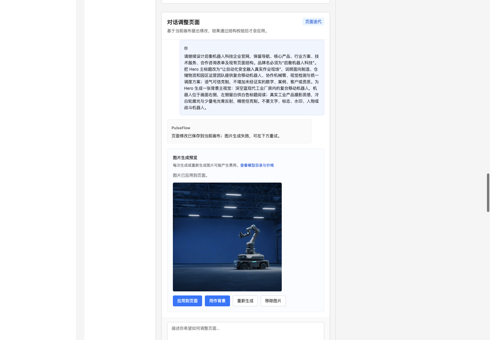
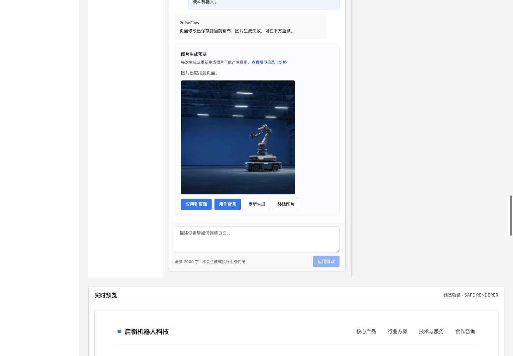
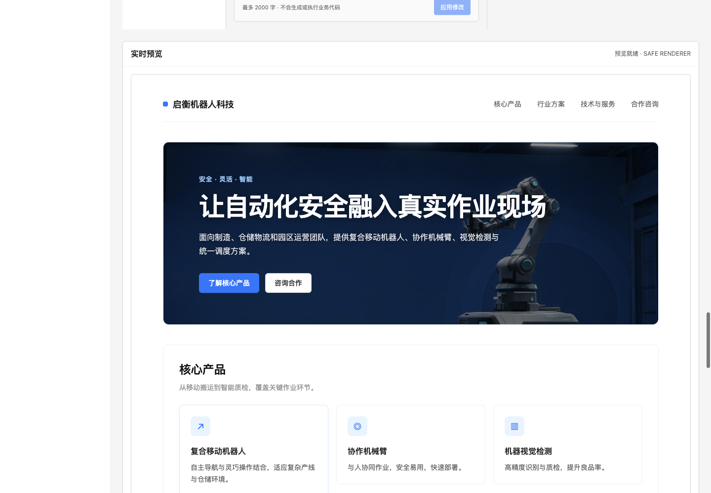
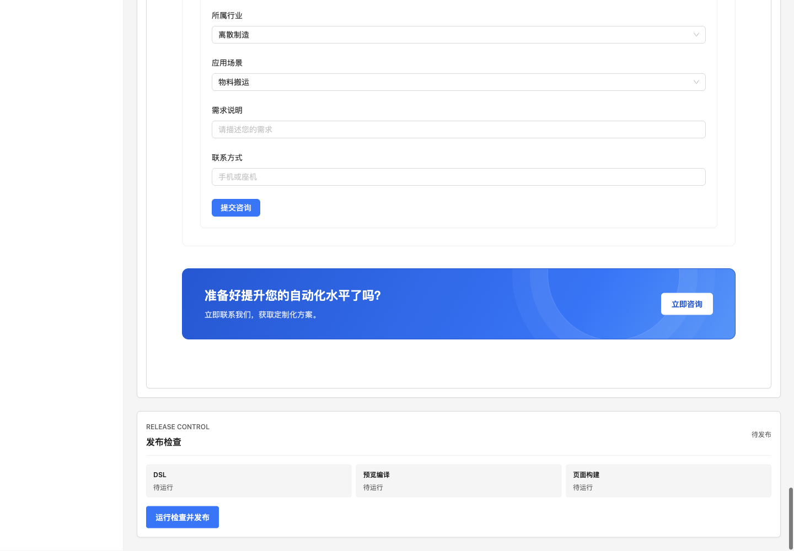
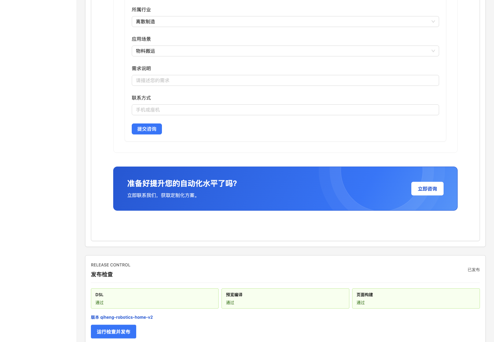

# PulseFlow 机器人官网制作手册 V1.1

这份手册记录如何从登录 PulseFlow Studio 开始，导入需求、通过系统对话修改启衡机器人科技官网、生成并应用机器人主视觉、检查预览和发布。文中的图片是本次 TaskSpace 5 操作界面的真实截图；截图和文档均未包含 API 密钥。

> **完成状态（2026-09-27）**：官网已发布为 `qiheng-robotics-home-v2`。DSL、预览编译、页面构建三项门禁全部通过；旧版本 `qiheng-robotics-home-v1` 保留。发布结果是 PulseFlow 的只读页面版本，尚未部署到公网。

## 成品目标

启衡机器人科技官网面向制造、仓储物流和园区运营团队，介绍复合移动机器人、协作机械臂、机器视觉检测、统一调度及相关服务。整体采用深空蓝、冷白和少量电光青的工业科技风格。首屏主视觉使用右侧机器人、左侧标题留白的构图，并为深色图片背景设置高对比文字。

## 操作流程

### 1. 登录 Studio

启动本地服务后打开 Studio 登录页。使用本地工作区令牌进入工作区。令牌保存在根目录 `.env`，不要粘贴到系统对话或写入手册。


### 2. 选择“企业官网”并导入需求

在“导入业务需求”中选择“企业官网”，再把需求按 Markdown 标题分段粘贴。分段后可以逐章检查并决定哪些内容交给生成服务。


本次需求包含品牌定位、核心产品、行业方案、技术服务、合作咨询和视觉方向。明确不编造客户案例、公司资质、产品型号或性能数字。


### 3. 选择生成章节

勾选六个相关章节。“关于启衡”没有足够的已核实资料，因此没有单独生成公司历史介绍。


### 4. 检查草稿、回答问题并校验

生成草稿后核对品牌、页面 ID、页面结构和实体字段。本次页面 ID 为 `qiheng-robotics-home`，表单包含所属行业、应用场景、需求说明和联系方式。

系统询问产品参数及客户案例时，回答“暂不展示未经核实的型号、性能数据、客户案例和资质”。点击“确认结构并校验”，看到校验通过后进入设计画布。


### 5. 在画布用系统对话修改页面

画布包括组件工具架、页面结构、属性检查器、实时预览和发布检查。通过“对话调整页面”描述想保留的结构、文案方向和图片要求；系统会校验结果，再应用到当前画布。


本次对话保留导航、产品、行业方案、技术服务和合作咨询表单，将 Hero 主标题调整为“让自动化安全融入真实作业现场”，并要求生成深蓝工业厂房中的复合移动机器人主视觉。


### 6. 配置火山方舟图片模型并重试

图片服务需在 API 服务启动前配置。项目根目录 `.env` 使用以下非密钥设置；`PULSEFLOW_IMAGE_API_KEY` 应填写你在方舟控制台创建的密钥，不要把真实值复制到 Markdown、截图或对话中。

```dotenv
PULSEFLOW_IMAGE_API_URL=https://ark.cn-beijing.volces.com/api/plan/v3/images/generations
PULSEFLOW_IMAGE_API_MODE=volcengine-ark-images
PULSEFLOW_IMAGE_MODEL_NAME=doubao-seedream-5.0-lite
PULSEFLOW_IMAGE_API_KEY=填写本机使用的方舟图片 API 密钥
PULSEFLOW_IMAGE_RESULT_HOSTS=ark-acg-cn-beijing.tos-cn-beijing.volces.com
```

首次请求失败时，先确认 API 由更新后的开发命令启动，并检查模型和接口配置。图片接口会返回限时图片链接；服务端验证来源地址、下载图片并转换为 PNG 后才会保存到画布。

> 本次按你的指示暂用此前发来的密钥。由于它曾以明文出现在聊天中，建议在火山方舟控制台轮换，并只更新本机根目录 `.env`。该文件已被 Git 忽略。


点击“重新生成”后，检查图片是否符合需求。成功状态会显示生成图片和“应用到页面”等操作；选择“用作背景”可将图片绑定到已选中的 Hero 或内容区块。





### 7. 检查整页实时预览

重点确认导航可读、主标题与深色背景有足够对比、机器人构图没有遮挡文字，并检查产品、行业方案、服务和咨询表单内容。



### 8. 运行发布门禁并发布

点击“运行检查并发布”。Studio 会运行 DSL 校验、预览编译和页面构建；全部通过后生成只读发布版本。



本次三个门禁全部通过，版本为 `qiheng-robotics-home-v2`。旧版 `qiheng-robotics-home-v1` 没有被覆盖。



## 下次如何启动和使用

1. 在项目根目录运行 `pnpm install`（首次使用时），然后运行 `pnpm dev`。
2. 打开终端显示的本地 Studio 地址，用 `.env` 中的工作区令牌登录。
3. 选择“企业官网”或“管理平台”，粘贴带标题的需求并解析。
4. 勾选生成章节、核对草稿并回答所有澄清问题，运行结构校验。
5. 在设计画布中用“对话调整页面”提出文案或视觉修改；图片请求明确说明目标节点、构图、风格和不希望出现的元素。
6. 检查生成图片，应用为页面图片或背景，再检查整页实时预览。
7. 点击“运行检查并发布”，确认所有门禁通过并记录发布版本号。

图片调用可能产生费用。不要重复点击生成；失败后先检查提示和服务配置再重试。

## 发布结果与后续部署

Studio 发布会把校验后的页面保存为只读版本，不会自动部署到公网。要把发布版本接入实际 Vue 项目，可继续阅读[中文使用指南](中文使用指南.md)并使用 PulseFlow CLI 导出页面文件。

本次截图目录：`docs/assets/pulseflow-robotics-manual-v1.1/`。
