# PulseFlow 机器人官网制作手册

本文记录使用 PulseFlow Studio 从登录、导入需求、选择页面章节，到生成、对话式调整、预览和发布的操作过程。截图只记录本次实际看到的界面，不用示意图代替系统操作记录。

> **制作进度（2026-09-27）**：Studio 登录、需求梳理、页面生成、文本对话修改、预览与发布的截图记录在本手册中；`qiheng-robotics-home-v1` 的 DSL、预览编译和页面构建门禁通过。最初 TokenRhythm 生图返回 HTTP 400，因此该版本没有机器人主视觉；已移除不符合主题的通用流程图背景。后续确认火山方舟 Seedream 接口并完成一次单图调用验证（橘猫示例，未放入官网）；项目适配器已实现并通过本地测试。机器人主视觉仍需在 Studio 通过对话生成、应用、预览并发布新版本。工作区发布会生成 PulseFlow 不可变版本，不等于已部署到公网；如需接入自己的 Vue 项目，请按项目中文指南使用 CLI `pull`。

## 本次目标

制作“启衡机器人”科技风企业官网，介绍复合移动机器人、协作机械臂、机器视觉检测和调度软件，面向制造、仓储和园区场景。表达安全协同、快速部署、灵活扩展；不编造客户案例、认证或性能数字。视觉方向为深空蓝、冷白、电光青、精密网格和克制光效。

## 操作步骤

### 1. 登录 Studio

打开 PulseFlow Studio 地址，填写工作区提供的账号和密码，点击登录。登录成功后会进入需求导入页面。不要把密码或访问令牌写进需求文档或截图。


### 2. 选择需求来源

在需求页面选择文本输入，适合直接粘贴产品介绍、页面大纲和设计要求。若已有需求文档，也可以使用页面提供的文件导入入口。

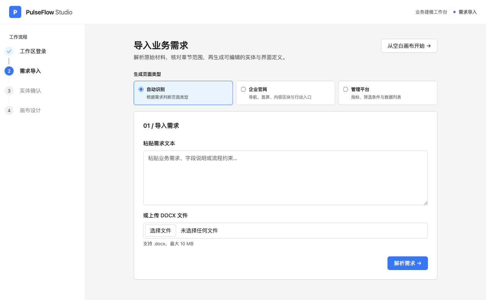

### 3. 输入官网需求

在文本框中描述品牌、产品、目标访客、希望展示的内容和视觉风格。明确指出哪些信息不能虚构，能减少生成页面出现未经证实的案例或数字。

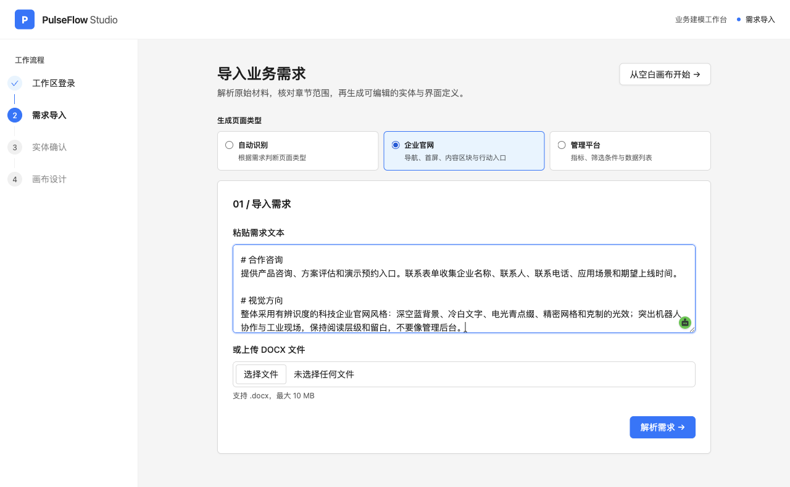

本次需求围绕启衡机器人官网，包含品牌定位、核心产品、行业方案、技术与服务、合作咨询和视觉方向。页面类型选择企业官网。

### 4. 选择生成章节

检查系统解析出的章节，只勾选确实要出现在网站中的内容。章节选择会影响首版页面的信息结构；生成后仍可通过设计对话继续调整文案与布局。

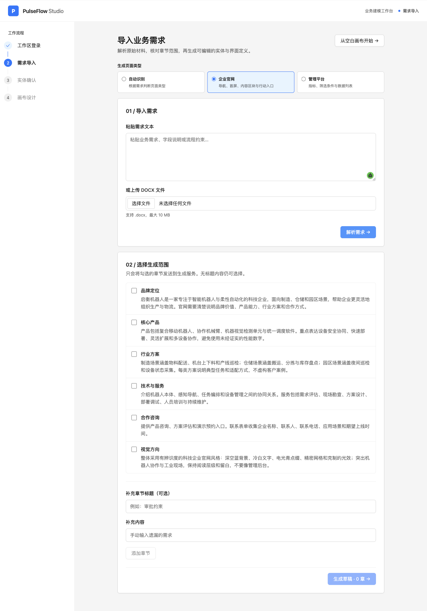

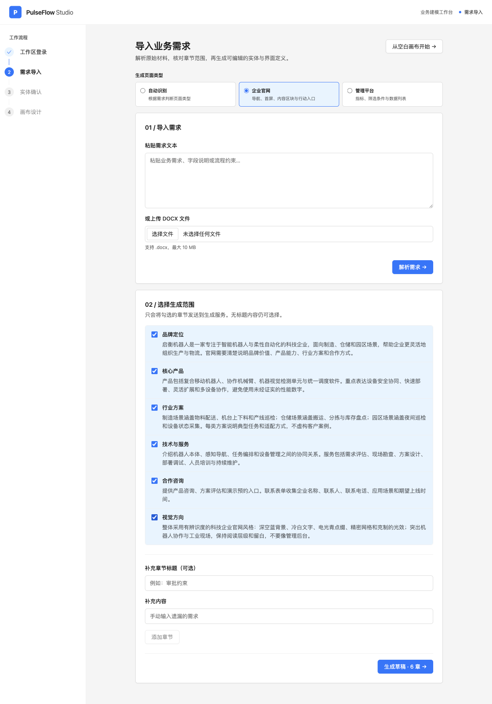

本次选择了 6 个章节：品牌定位、核心产品、行业方案、技术与服务、合作咨询、视觉方向。确认后点击“生成页面”。

### 5. 生成页面草稿

点击生成后，系统会根据已选章节生成 UI-DSL 草稿，并进入草稿检查页。本次首次遇到“Model returned an invalid draft. Try again.”；项目原本把 JSON、DSL、页面类型和官网结构错误都合并成同一提示。为方便排错，已调整错误反馈：格式错误会指出字段路径，官网结构不完整会列出缺少的页面部分。随后重新生成成功。

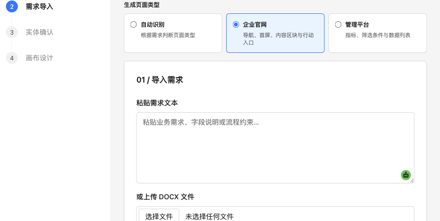

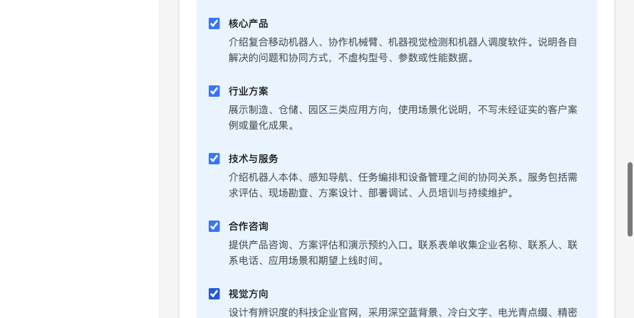

### 6. 检查草稿并回答待确认问题

检查标题、导航、首屏文案、产品能力和联系入口。模型提出的问题需依据需求材料回答。本次确认不展示未经证实的具体型号或参数；提供演示预约入口，但现阶段仅通过咨询表单收集需求，不承诺在线日历或自动排期。然后点击“确认结构并校验”。

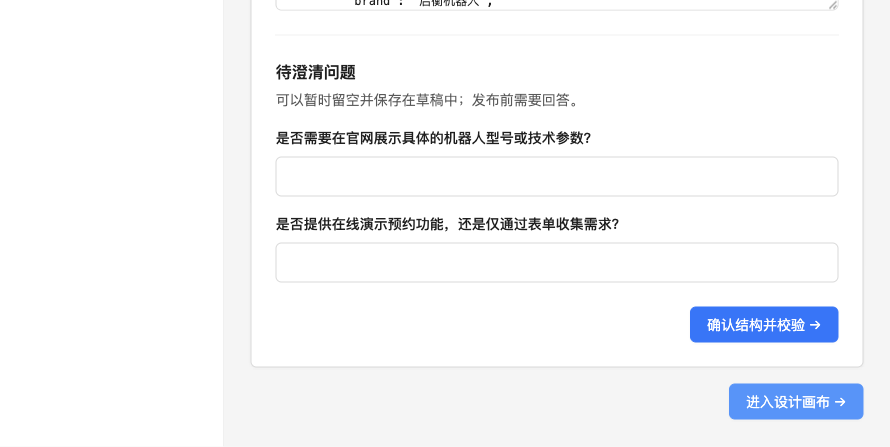

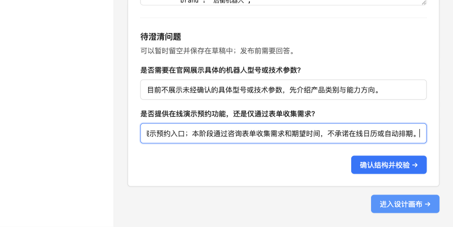

### 7. 在画布查看页面并用对话修改

进入画布后先检查页面节点和右侧属性。随后在“对话调整页面”中提出具体要求。本次对话要求突出“让自动化安全融入真实作业现场”，保留导航、产品和咨询章节，并为首屏生成复合移动机器人主视觉。文本修改已通过校验并保存到当前画布。

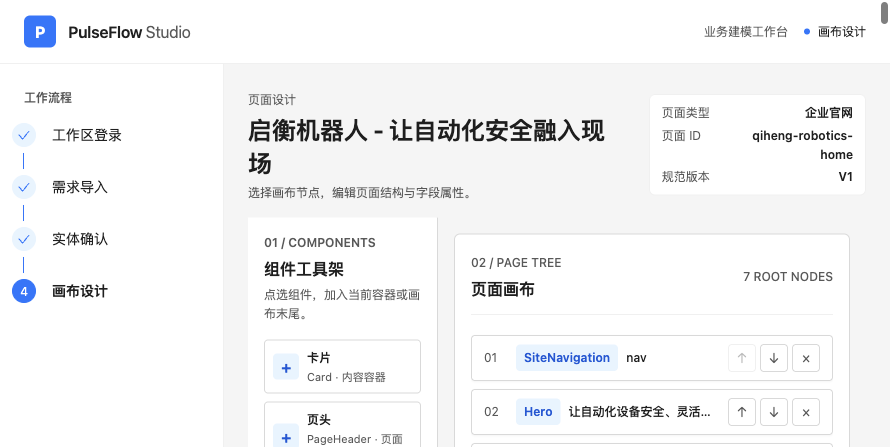

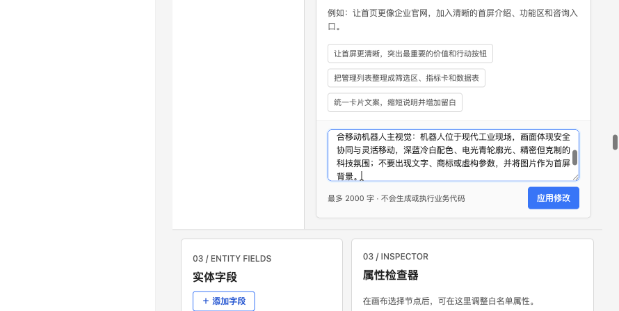

### 8. 检查图片结果并处理生成失败

图片生成失败时，系统会保留已经成功的页面文案修改，不会把不完整图片资源应用到画布。首次重试时发现本地 API 未载入 `.env` 中的工作区令牌，返回 `Unauthorized`；按 [中文使用指南](中文使用指南.md) 在启动 API 的终端加载 `.env` 后，鉴权探测通过。随后图片服务返回 HTTP 400，并提示检查图片模型名称和 API 模式。

项目文档记录了 TokenRhythm 图像调用协议尚未获得完整响应规范；随后改用火山方舟验证 Seedream 请求。已从 Hero 移除与机器人无关的通用 Workflow 背景，避免错误素材留在首屏。

TokenRhythm 的公开文档未能确认图像接口，因此不再使用该网关测试生图。

### 火山方舟 Seedream 接口实测

用户提供的方舟图片接口返回 HTTP 200，模型为 `doubao-seedream-5.0-lite`，请求使用 `size: 2K`、`response_format: url` 和 `watermark: false`。响应是带临时签名的 JPEG 图片 URL，尺寸 `2048x2048`。本次只生成了橘猫程序员示例图，用于确认接口协议，没有作为官网图片。

项目接入时在本地 `.env` 单独配置图片 API，不要把密钥写入文本模型配置、文档或截图：

```dotenv
PULSEFLOW_IMAGE_API_URL=https://ark.cn-beijing.volces.com/api/plan/v3/images/generations
PULSEFLOW_IMAGE_API_MODE=volcengine-ark-images
PULSEFLOW_IMAGE_MODEL_NAME=doubao-seedream-5.0-lite
PULSEFLOW_IMAGE_API_KEY=替换为已轮换的方舟API密钥
PULSEFLOW_IMAGE_RESULT_HOSTS=ark-acg-cn-beijing.tos-cn-beijing.volces.com
```

图片响应为 JPEG，PulseFlow 资源链路使用 PNG；适配器会在服务端按像素上限解码、校验并转为 PNG，再进入 Studio 预览与发布。Studio 的 Monaco 源码编辑器也已调整为用户展开时才加载，减少设计页初始资源体积。用户曾在对话中贴出 API 凭证，继续使用前应先在方舟控制台轮换。

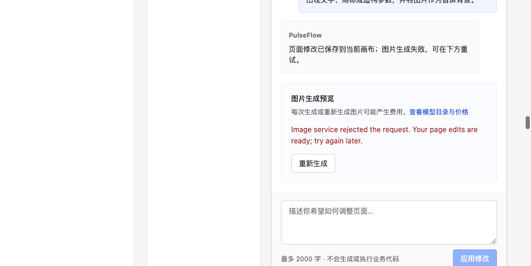

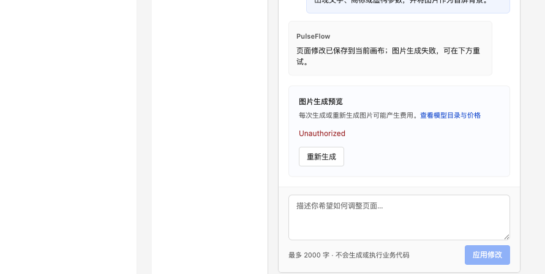

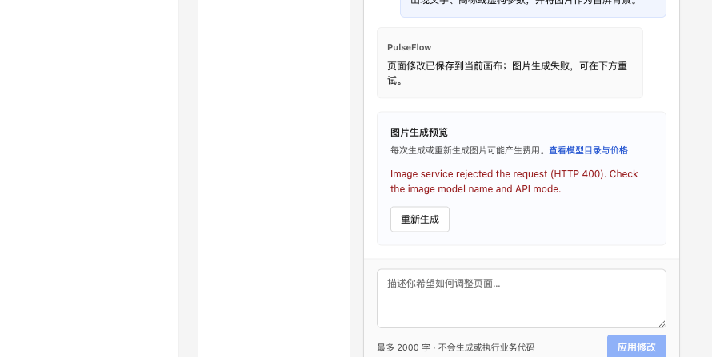

### 9. 预览官网

在实时预览中检查首屏、导航、产品卡片、行业方案、服务流程、咨询表单和底部 CTA。确认章节锚点可用、文案没有虚构参数或案例，并留意图片加载状态。本次通过预览编译，Hero 上不再显示与主题无关的流程图。

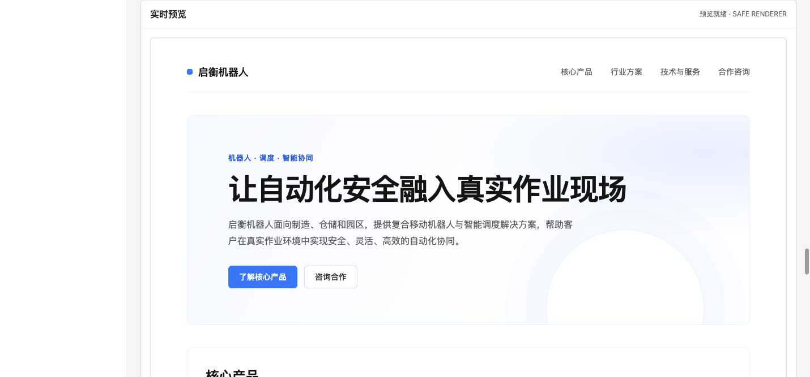

### 10. 运行发布门禁并发布

滚动到发布检查面板，点击“运行检查并发布”。本次 DSL、预览编译和页面构建均通过，Studio 显示版本 `qiheng-robotics-home-v1`。

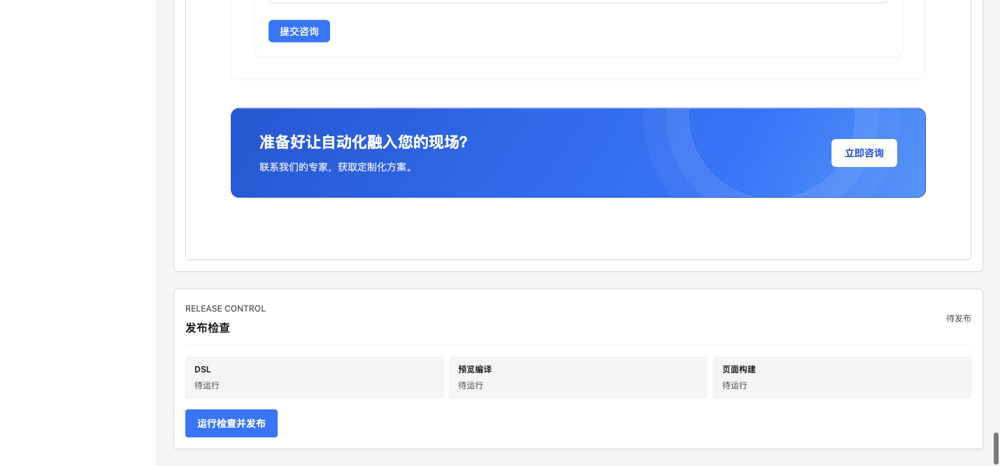

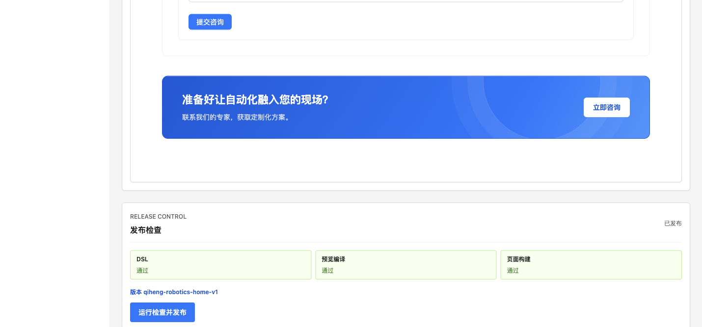

此版本已保存在 PulseFlow 发布仓库，尚未部署到公网。要把页面放入实际 Vue 项目，请参考 [中文使用指南](中文使用指南.md) 中的 CLI 拉取步骤；图片接口确认兼容后，可以在 Studio 继续生成并发布新的版本。

## 截图目录

实际已记录的截图位于 `docs/assets/pulseflow-robotics-manual/`：

- `01-login.png`：登录页面
- `02-requirements.png`：需求来源选择
- `03-requirement-text.png`：机器人官网需求文本
- `04-chapter-selection.png`：章节选择
- `05-selected-chapters.png`：已选章节
- `06-generation-input.png`、`07-selected-chapters.png`：重新解析并选择六个官网章节
- `08-draft-review.png`、`09-answered-questions.png`：草稿检查与回答语义问题
- `10-design-canvas.png`、`11-chat-request.png`：设计画布与对话修改
- `12-image-failed.png`、`13-image-retry-error.png`、`14-image-generation-result.png`：生图失败、鉴权问题及服务商 HTTP 400
- `15-page-preview.png`：官网实时预览
- `16-before-publish.png`、`17-publish-result.png`：发布门禁和发布成功

## 当前已知限制与后续操作

1. 确认 TokenRhythm 图像模型实际支持的 API 路径、模式和响应格式，再调整 API 环境配置。
2. 按第 7 步通过对话重新生成机器人主视觉，检查图片后应用到 Hero。
3. 在 Studio 通过对话生成机器人主视觉，应用后复核预览，再发布新版本。不要覆盖或删除已经发布的 `qiheng-robotics-home-v1`。
